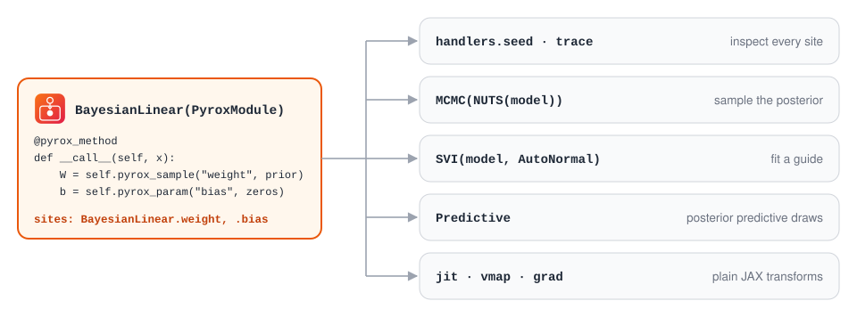
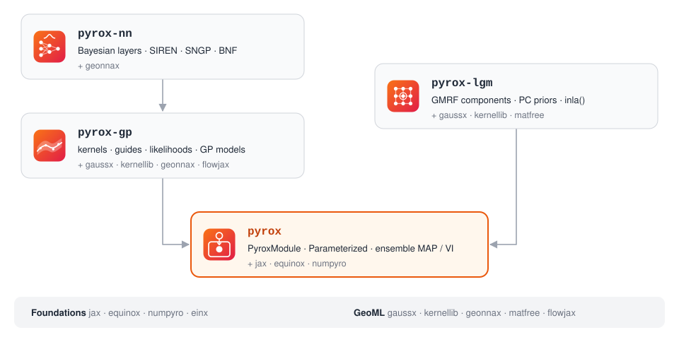
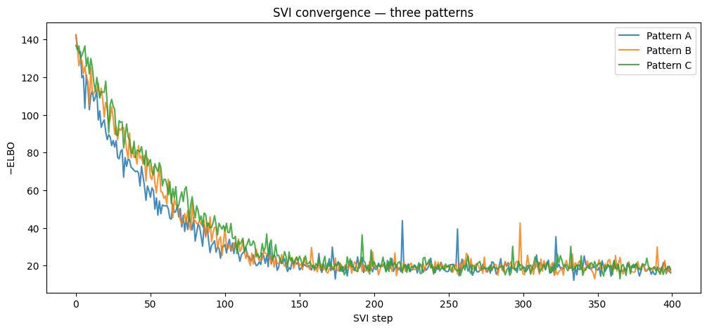
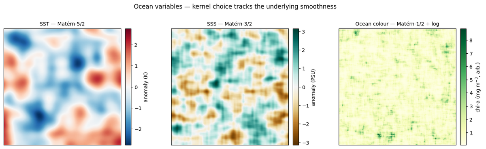
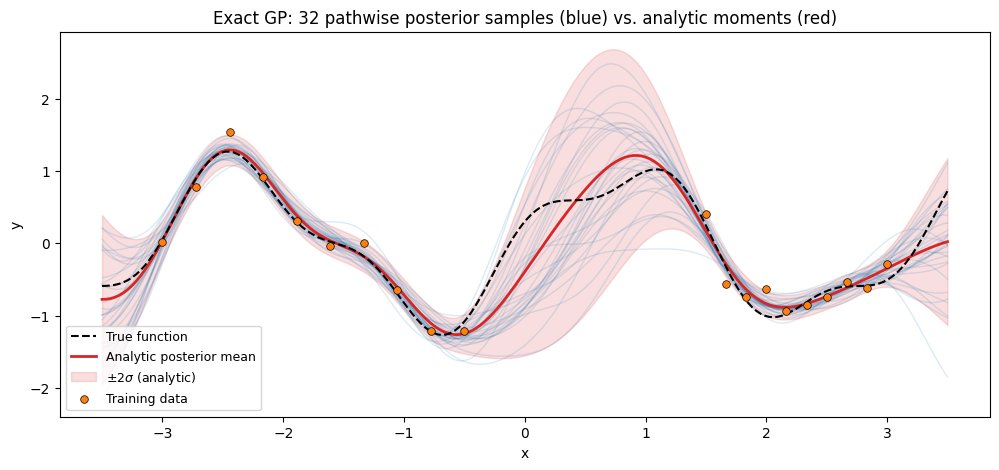
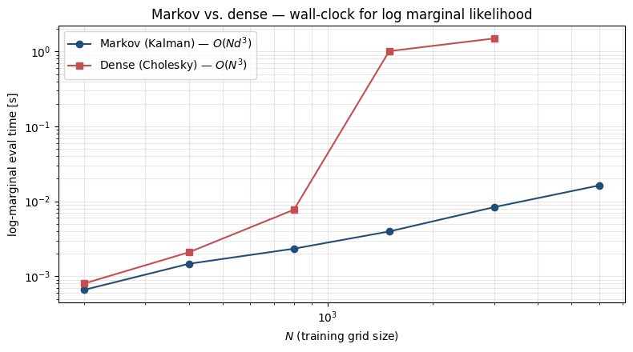
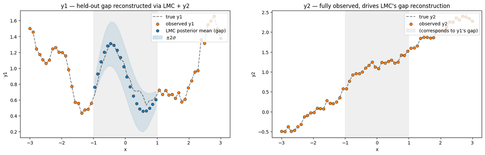
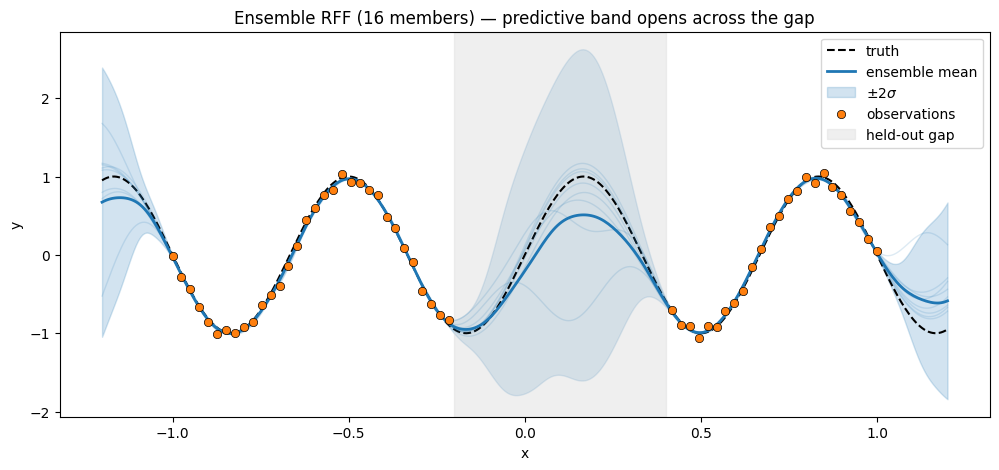
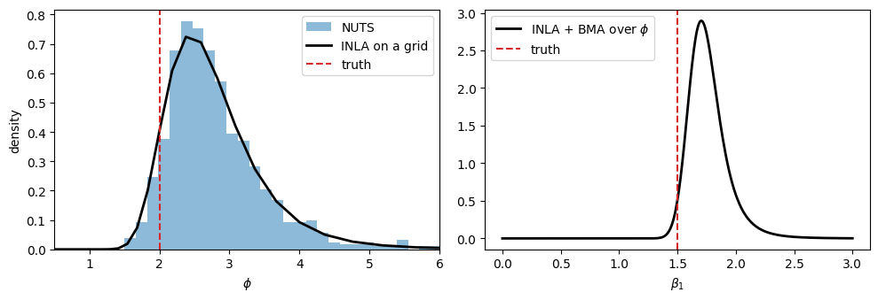
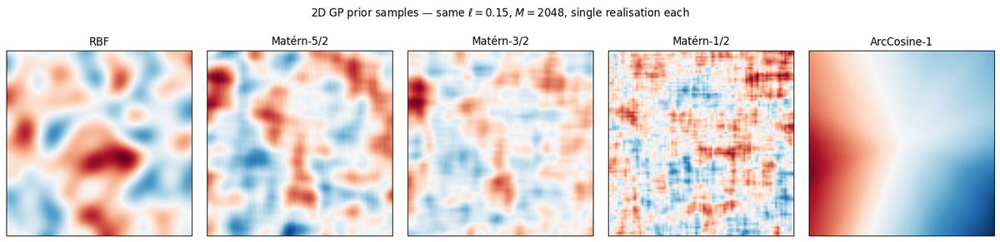

<p align="center">
  <picture>
    <source media="(prefers-color-scheme: dark)" srcset="docs/assets/logo-dark.svg">
    
  </picture>
</p>

<p align="center">
  <a href="https://github.com/jejjohnson/pyrox/actions/workflows/ci.yml"></a>
  <a href="https://github.com/jejjohnson/pyrox/actions/workflows/typecheck.yml"></a>
  <a href="https://codecov.io/gh/jejjohnson/pyrox"></a>
  
  <a href="https://opensource.org/licenses/MIT"></a>
</p>

<p align="center">
  <a href="https://jejjohnson.github.io/pyrox/"><b>Docs</b></a> ·
  <a href="https://jejjohnson.github.io/pyrox/api/reference/"><b>API</b></a> ·
  <a href="https://jejjohnson.github.io/pyrox/notebooks/regression_masterclass_treeat/"><b>Tutorials</b></a> ·
  <a href="#gallery"><b>Gallery</b></a>
</p>

**Probabilistic modeling with Equinox and NumPyro: Gaussian processes, Bayesian neural networks and latent Gaussian models.**

pyrox lets an Equinox module declare NumPyro sample and param sites under stable, module-scoped names.
NumPyro owns inference; pyrox makes modules visible to it.
Write one `__call__` and it runs unchanged under `handlers.trace`, NUTS, SVI with any `AutoGuide`, `Predictive`, `jit`, `vmap` and `grad`.

<p align="center">
  <picture>
    <source media="(prefers-color-scheme: dark)" srcset="docs/assets/hero-dark.svg">
    
  </picture>
</p>

## The packages

pyrox is a [uv workspace](https://docs.astral.sh/uv/concepts/projects/workspaces/) of four packages under [`packages/`](packages).
Each one installs on its own and pulls in what it needs.

| | Package | Import | What it holds |
|---|---|---|---|
|  | [`pyrox`](packages/pyrox) | `pyrox` | The Equinox ↔ NumPyro bridge (`PyroxModule`, `Parameterized`, `pyrox_method`) and ensemble MAP / VI inference |
|  | [`pyrox-gp`](packages/pyrox-gp) | `pyrox_gp` | Kernels, guides and likelihoods; exact, sparse, Markov and multi-output GPs; pathwise sampling |
|  | [`pyrox-nn`](packages/pyrox-nn) | `pyrox_nn` | Bayesian dense layers, SIREN and MFN, SNGP, deep VSSGP, and the Bayesian Neural Field estimator |
|  | [`pyrox-lgm`](packages/pyrox-lgm) | `pyrox_lgm` | Latent Gaussian models in precision form: GMRF components, PC priors and `inla()` |

<p align="center">
  <picture>
    <source media="(prefers-color-scheme: dark)" srcset="docs/assets/layers-dark.svg">
    
  </picture>
</p>

Arrows point at what a package imports, and nothing points back up.
`pyrox-lgm` works in precision form and never imports `pyrox-gp`.

## Installation

pyrox is not on PyPI yet.
The name `pyrox` on PyPI belongs to an unrelated project, so `pip install pyrox` installs the wrong package.
Install from GitHub with [uv](https://docs.astral.sh/uv/):

```bash
# Core: the bridge and ensemble inference
uv add "pyrox @ git+https://github.com/jejjohnson/pyrox.git#subdirectory=packages/pyrox"

# GP, NN and LGM packages; each one pulls in pyrox from the same repository
uv add "pyrox-gp @ git+https://github.com/jejjohnson/pyrox.git#subdirectory=packages/pyrox-gp"
uv add "pyrox-nn @ git+https://github.com/jejjohnson/pyrox.git#subdirectory=packages/pyrox-nn"
uv add "pyrox-lgm @ git+https://github.com/jejjohnson/pyrox.git#subdirectory=packages/pyrox-lgm"
```

`pyrox-gp`, `pyrox-nn` and `pyrox-lgm` depend on [gaussx](https://github.com/jejjohnson/gaussx) and [kernellib](https://github.com/jejjohnson/kernellib), which are also installed from GitHub.
kernellib v0.0.17 and v0.0.18 pin gaussx v0.6.1 while pyrox needs v0.6.5, so until a kernellib release pins v0.6.5, add this override to your project's `pyproject.toml`:

```toml
[tool.uv]
override-dependencies = ["gaussx @ git+https://github.com/jejjohnson/gaussx.git@v0.6.5"]
```

Without it the install fails to resolve; with an older gaussx it resolves but `import pyrox_gp` fails.

Optional extras: `pyrox[optax]` for ensemble MAP, `pyrox-nn[bnf]` for the BNF estimator (pandas, optax), `pyrox-gp[flows]` for normalizing-flow warps, and `pyrox-lgm[xarray]` for xarray-backed `INLAResult` marginals.

To work on pyrox itself, clone it and run `make install`; see [Development](#development).

## Quick start

A Bayesian linear layer that owns its sites, fitted by NUTS and by SVI from the same model.

```python
import jax.numpy as jnp
import jax.random as jr
import numpyro
import numpyro.distributions as dist
from jaxtyping import Array, Float
from numpyro import handlers
from numpyro.infer import MCMC, NUTS, SVI, Predictive, Trace_ELBO
from numpyro.infer.autoguide import AutoNormal
from numpyro.optim import Adam
from pyrox._core import PyroxModule, pyrox_method

# Shapes: N = 50 observations, D = 1 input, P = 1 output, S = 300 posterior draws


class BayesianLinear(PyroxModule):
    pyrox_name = "BayesianLinear"                          # scopes every site name below
    in_features: int
    out_features: int

    @pyrox_method
    def __call__(self, x: Float[Array, "N D"]) -> Float[Array, "N P"]:
        # W ~ 𝒩(0, I)
        prior = dist.Normal(0.0, 1.0).expand([self.in_features, self.out_features])
        W = self.pyrox_sample("weight", prior.to_event(2))  # (D, P)   site BayesianLinear.weight
        # b, a point estimate
        b = self.pyrox_param("bias", jnp.zeros(self.out_features))  # (P,)   site BayesianLinear.bias
        # f = x W + b
        return x @ W + b                                   # (N, D) → (N, P)


layer = BayesianLinear(in_features=1, out_features=1)


def model(x: Float[Array, "N D"], y: Float[Array, " N"] | None = None) -> None:
    # y = x W + b + ε,  ε ~ 𝒩(0, 0.1² I)
    f: Float[Array, " N"] = layer(x)[:, 0]                 # (N, D) → (N,)
    numpyro.sample("obs", dist.Normal(f, 0.1), obs=y)      # event ()   site obs


# Data: y = 2x + ε on x ∈ [−1, 1]
x: Float[Array, "N D"] = jnp.linspace(-1.0, 1.0, 50)[:, None]          # (N, 1)
y: Float[Array, " N"] = 2.0 * x[:, 0] + 0.1 * jr.normal(jr.key(0), (50,))  # (N,)

# The sites NumPyro sees: ['BayesianLinear.weight', 'BayesianLinear.bias', 'obs']
sites: list[str] = list(handlers.trace(handlers.seed(model, 0)).get_trace(x, y))

# p(W | y) ∝ p(y | W) p(W), by NUTS
mcmc = MCMC(NUTS(model), num_warmup=300, num_samples=300)
mcmc.run(jr.key(1), x, y)
# q(W) ≈ p(W | y), by SVI with a mean-field guide, from the same model
svi = SVI(model, AutoNormal(model), Adam(1e-2), Trace_ELBO())
svi_result = svi.run(jr.key(2), 1000, x, y)

# y* ~ p(y* | x, y) = ∫ p(y* | x, W) p(W | y) dW
draws: Float[Array, "S N"] = Predictive(model, mcmc.get_samples())(jr.key(3), x)["obs"]  # (S, N)
```

`layer(x)` runs under `handlers.trace`, NUTS, SVI and `Predictive` unchanged: the posterior mean of `BayesianLinear.weight` comes out at 1.97 against the true slope of 2.

## Example: map methane from one overpass

The running example of the GeoML stack, cut down to what pyrox does: map XCH₄ over a basin from the cloud-free pixels of one TROPOMI overpass, with a per-pixel uncertainty.

The state x ∈ ℝᴺ is XCH₄ in ppb on a 20 × 20 grid over the Permian Basin, so N = 400 cells.
One overpass leaves M of them cloud-free; `mask` marks those cells and y ∈ ℝᴹ holds their values.
x_b = 1,880 ppb is the background.
Cell centres are 3-D positions sᵢ in km on a sphere of radius R_E = 6,371 km, so ‖sᵢ − sⱼ‖ is a chordal distance in km.
The block below simulates the overpass (a 40 ppb plume, σ_obs = 8 ppb pixel noise, 60 % cloud-free); a real L2 product's pixels drop in for `lonlat`, `mask` and `y`.

```python
import geonnax as gnx
import jax
import jax.numpy as jnp
import jax.random as jr
import numpyro
import numpyro.distributions as dist
import pyrox_gp as pgp
from jaxtyping import Array, Bool, Float
from numpyro.infer import MCMC, NUTS, SVI, Trace_ELBO, init_to_median
from numpyro.infer.autoguide import AutoNormal
from numpyro.optim import Adam

jax.config.update("jax_enable_x64", True)

# Shapes: N = 400 grid cells (20 × 20); M = Σᵢ maskᵢ cloud-free cells; S = 500 draws
lon, lat = jnp.meshgrid(jnp.linspace(-104.2, -103.4, 20), jnp.linspace(31.6, 32.4, 20))
lonlat: Float[Array, "N 2"] = jnp.stack([lon.ravel(), lat.ravel()], axis=-1)  # (N, 2) degrees
# s(λ, φ) = R_E (cos φ cos λ, cos φ sin λ, sin φ),  R_E = 6,371 km, so ‖sᵢ − sⱼ‖ is in km
unit: Float[Array, "N 3"] = gnx.geo.lonlat_to_cartesian3d(lonlat, input_unit="degrees")
s: Float[Array, "N 3"] = 6371.0 * unit                     # (N, 2) → (N, 3) km   geonnax

# Stand-in overpass. x(λ, φ) = x_b + 40 exp(−‖(λ, φ) − (λ₀, φ₀)‖² / 2·0.08²) ppb
x_b: float = 1880.0                                        # background XCH₄, ppb
d2: Float[Array, " N"] = jnp.sum((lonlat - jnp.array([-103.8, 32.0])) ** 2, axis=-1)
x_true: Float[Array, " N"] = x_b + 40.0 * jnp.exp(-d2 / (2 * 0.08**2))  # (N,) ppb
# yᵢ = xᵢ + εᵢ,  εᵢ ~ 𝒩(0, 8²),  kept where the pixel is cloud-free (p = 0.6)
k_mask, k_noise = jr.split(jr.key(0))
mask: Bool[Array, " N"] = jr.bernoulli(k_mask, 0.6, (400,))                # (N,)
y: Float[Array, " M"] = (x_true + 8.0 * jr.normal(k_noise, (400,)))[mask]  # (N,) → (M,)
s_obs: Float[Array, "M 3"] = s[mask]                                       # (N, 3) → (M, 3)
```

### Stage 1: tune the covariance by its evidence (geonnax → pyrox-gp → NumPyro)

**TL;DR.** Choose the field's correlation length and variance, and the pixel noise, by asking which values make the observed pixels most probable once the unknown field is integrated out.

**Problem.** θ = (ℓ, σ², σ_obs) holds the Matérn-3/2 lengthscale ℓ (km), its variance σ² (ppb²) and the pixel noise σ_obs (ppb).
k_θ is the Matérn-3/2 kernel and K_θ ∈ ℝ^{M×M} its Gram matrix on the observed centres.
The anomaly x − x_b is a Gaussian process, and each observed pixel adds independent noise:

$$x - x_b \sim \mathcal{GP}(0, k_\theta)$$

$$y_i = x(s_i) + \varepsilon_i$$

$$\varepsilon_i \sim \mathcal{N}(0, \sigma_{\mathrm{obs}}^2)$$

Integrating out x gives the evidence, the only term that depends on θ:

$$\log p(y \mid \theta) = \log \mathcal{N}(y - x_b; 0, K_\theta + \sigma_{\mathrm{obs}}^2 I_M)$$

The goal is the hyperparameter posterior p(θ | y) ∝ p(y | θ) p(θ), sampled by NUTS, or its mean-field approximation q(θ) fitted by SVI.

```python
def evidence(s_obs: Float[Array, "M 3"], y: Float[Array, " M"]) -> None:
    # k_θ(r) = σ² (1 + √3 r / ℓ) exp(−√3 r / ℓ),  Matérn-3/2, r = ‖sᵢ − sⱼ‖ in km
    k = pgp.Matern(nu=1.5)                                 # pyrox-gp: a Parameterized kernel
    # ℓ ~ LogNormal(3, 0.5): median 20 km
    k.set_prior("lengthscale", dist.LogNormal(3.0, 0.5))
    # σ² ~ LogNormal(5, 1): median 150 ppb²
    k.set_prior("variance", dist.LogNormal(5.0, 1.0))
    # σ_obs ~ LogNormal(2.3, 0.5): median 10 ppb, bounded away from zero
    sigma_obs = numpyro.sample("sigma_obs", dist.LogNormal(2.3, 0.5))  # ()
    # log p(y | θ) = log 𝒩(y − x_b; 0, K_θ + σ_obs² I_M),  K_θ = [k_θ(sᵢ, sⱼ)]ᵢⱼ
    prior = pgp.GPPrior(kernel=k, X=s_obs)                 # (M, 3) → GP over M cells   pyrox-gp
    pgp.gp_factor("y", prior, y - x_b, sigma_obs**2)       # (M,) → () log-evidence    pyrox-gp


# (a) p(θ | y) ∝ p(y | θ) p(θ), sampled by NUTS
mcmc = MCMC(NUTS(evidence, init_strategy=init_to_median), num_warmup=500, num_samples=500)
mcmc.run(jr.key(1), s_obs, y)
theta: dict[str, Float[Array, " S"]] = mcmc.get_samples()  # sites → (S,)

# (b) q(θ) ≈ p(θ | y), fitted by SVI with a mean-field guide on the same model
svi = SVI(evidence, AutoNormal(evidence), Adam(1e-2), Trace_ELBO())
svi_result = svi.run(jr.key(2), 2000, s_obs, y)
```

`pgp.Matern` is a [Pattern C](#three-modeling-patterns) module: `set_prior` turns each hyperparameter into a NumPyro site named `Matern.<name>`, so one model function serves NUTS and SVI.
On the simulated overpass (M = 227 of 400 cells), NUTS puts σ_obs at 8.0 ppb (90 % interval 7.3–8.7) against the true 8 ppb, and ℓ at about 18 km.
`init_to_median` and a σ_obs prior bounded away from zero keep warm-up away from a near-singular K_θ + σ²_obs I_M.

### Stage 2: the map and its uncertainty (pyrox-gp → gaussx)

**TL;DR.** With θ fixed at its posterior median θ̂, compute the best-estimate XCH₄ map on all N cells and its per-cell standard deviation.

**Problem.** K_MM is the Gram matrix on the observed cells, K_NM the cross-covariance from all cells to the observed ones, and K_iM its i-th row.
Conditioning the Gaussian process on y is closed-form:

$$x_a = x_b + K_{NM} (K_{MM} + \hat\sigma_{\mathrm{obs}}^2 I_M)^{-1} (y - x_b)$$

$$\Sigma_{ii} = k_{\hat\theta}(s_i, s_i) - K_{iM} (K_{MM} + \hat\sigma_{\mathrm{obs}}^2 I_M)^{-1} K_{Mi}$$

x_a ∈ ℝᴺ is the analysis and sdᵢ = √Σᵢᵢ its per-cell standard deviation, including at the clouded cells.

```python
# θ̂ = the posterior median of each site
ell = float(jnp.median(theta["Matern.lengthscale"]))       # ()  km
var = float(jnp.median(theta["Matern.variance"]))          # ()  ppb²
sig = float(jnp.median(theta["sigma_obs"]))                # ()  ppb
k_hat = pgp.Matern(nu=1.5, init_lengthscale=ell, init_variance=var)

# x_a = x_b + K_NM (K_MM + σ̂²_obs I_M)⁻¹ (y − x_b)
# Σᵢᵢ = k(sᵢ, sᵢ) − K_iM (K_MM + σ̂²_obs I_M)⁻¹ K_Mi
post = pgp.GPPrior(kernel=k_hat, X=s_obs).condition(y - x_b, jnp.array(sig**2))  # pyrox-gp
mean, var_a = post.predict(s)                              # (N, 3) → (N,), (N,)
x_a: Float[Array, " N"] = x_b + mean                       # (N,)  ppb
sd: Float[Array, " N"] = jnp.sqrt(var_a)                   # (N,)  ppb
```

The map's RMSE against the true field is 3.4 ppb, against 8.2 ppb for the raw pixels, and 95.5 % of cells lie within ±2 sd of the truth.
The plume peak comes out at 1,906 ppb against a true 1,917 ppb: a kernel this smooth flattens a narrow peak.
Both stages run in float64 in about 50 s on a laptop CPU.
To carry θ's uncertainty into the map, condition on each NUTS draw instead of the median and pool the results.

## Three modeling patterns

pyrox is opinionated about how Equinox and NumPyro compose, not about when to reach for which piece.
Three patterns cover the common cases, from lightest to heaviest machinery.
Here each one writes the Stage 1 evidence model.

**A. Plain sites and `eqx.tree_at`.**
When a field of an existing Equinox module becomes random, you need no pyrox machinery at all.
Sample the value in the model and splice it into the module.

```python
import equinox as eqx
import kernellib as kl


# A. Plain sites, spliced into a kernellib kernel with eqx.tree_at
def evidence_a(s_obs: Float[Array, "M 3"], y: Float[Array, " M"]) -> None:
    ell = numpyro.sample("lengthscale", dist.LogNormal(3.0, 0.5))      # ()  ℓ, km
    var = numpyro.sample("variance", dist.LogNormal(5.0, 1.0))         # ()  σ², ppb²
    k = eqx.tree_at(lambda k: (k.lengthscale, k.variance), kl.Matern(nu=1.5), (ell, var))
    sigma_obs = numpyro.sample("sigma_obs", dist.LogNormal(2.3, 0.5))  # ()  ppb
    pgp.gp_factor("y", pgp.GPPrior(kernel=k, X=s_obs), y - x_b, sigma_obs**2)  # (M,) → ()
```

**B. A `PyroxModule` owns its sites.**
When the module is itself probabilistic (a Bayesian layer, a hierarchical component), subclass `PyroxModule`, as in the quick start.
Sites are named `<pyrox_name>.<site>`, cached per call, and stable across `jit`, `eqx.tree_at` and checkpoints.
Two instances of one class in the same model need distinct `pyrox_name`s; otherwise the trace rejects the duplicate sites.

```python
import kernellib.functional as klf
from pyrox._core import PyroxModule, pyrox_method


# B. A PyroxModule kernel that samples its own θ inside __call__
class MaternSites(pgp.Kernel, PyroxModule):
    pyrox_name: str = "MaternSites"

    @pyrox_method
    def __call__(self, X1: Float[Array, "N1 3"], X2: Float[Array, "N2 3"]) -> Float[Array, "N1 N2"]:
        ell = self.pyrox_sample("lengthscale", dist.LogNormal(3.0, 0.5))  # ()  → MaternSites.lengthscale
        var = self.pyrox_sample("variance", dist.LogNormal(5.0, 1.0))     # ()  → MaternSites.variance
        # k_θ(r) = σ² (1 + √3 r / ℓ) exp(−√3 r / ℓ)
        return klf.matern_kernel(X1, X2, var, ell, nu=1.5)                # (N1, 3), (N2, 3) → (N1, N2)


def evidence_b(s_obs: Float[Array, "M 3"], y: Float[Array, " M"]) -> None:
    sigma_obs = numpyro.sample("sigma_obs", dist.LogNormal(2.3, 0.5))  # ()  ppb
    pgp.gp_factor("y", pgp.GPPrior(kernel=MaternSites(), X=s_obs), y - x_b, sigma_obs**2)
```

**C. `Parameterized` for constraints, priors and guides.**
When a module has constrained hyperparameters with priors (GP kernels are the canonical case), declare them once in `setup()`: `register_param` puts each value on its support, `set_prior` attaches p(θ), and `autoguide` attaches a per-parameter q(θ).
`set_mode("model")` makes `get_param` sample the prior and `set_mode("guide")` makes it sample the guide, so the module is its own SVI guide and `__call__` never changes.
`pgp.Matern` in Stage 1 is a ready-made one; here is the same kernel written out:

```python
import kernellib.functional as klf
from pyrox._core import Parameterized, pyrox_method


# C. A Parameterized kernel: constraints, priors and guides declared once, in setup()
class MaternPriors(Parameterized, pgp.Kernel):
    pyrox_name: str = "MaternPriors"

    def setup(self) -> None:
        # ℓ > 0 and σ² > 0: each value lives on the positive support
        positive = dist.constraints.positive
        self.register_param("lengthscale", jnp.array(20.0), constraint=positive)  # ()  km
        self.register_param("variance", jnp.array(150.0), constraint=positive)    # ()  ppb²
        # p(θ): ℓ ~ LogNormal(3, 0.5),  σ² ~ LogNormal(5, 1)
        self.set_prior("lengthscale", dist.LogNormal(3.0, 0.5))
        self.set_prior("variance", dist.LogNormal(5.0, 1.0))
        # q(θ): a Normal on each unconstrained value, mapped back onto ℓ, σ² > 0
        self.autoguide("lengthscale", "normal")
        self.autoguide("variance", "normal")

    @pyrox_method
    def __call__(self, X1: Float[Array, "N1 3"], X2: Float[Array, "N2 3"]) -> Float[Array, "N1 N2"]:
        # model mode: θ ~ p(θ);  guide mode: θ ~ q(θ)
        ell = self.get_param("lengthscale")                # ()  site MaternPriors.lengthscale
        var = self.get_param("variance")                   # ()  site MaternPriors.variance
        # k_θ(r) = σ² (1 + √3 r / ℓ) exp(−√3 r / ℓ)
        return klf.matern_kernel(X1, X2, var, ell, nu=1.5)  # (N1, 3), (N2, 3) → (N1, N2)


kernel = MaternPriors()


def evidence_c(s_obs: Float[Array, "M 3"], y: Float[Array, " M"]) -> None:
    kernel.set_mode("model")                               # θ ~ p(θ)
    sigma_obs = numpyro.sample("sigma_obs", dist.LogNormal(2.3, 0.5))  # ()  ppb
    pgp.gp_factor("y", pgp.GPPrior(kernel=kernel, X=s_obs), y - x_b, sigma_obs**2)  # (M,) → ()


def guide_c(s_obs: Float[Array, "M 3"], y: Float[Array, " M"]) -> None:
    kernel.set_mode("guide")                               # θ ~ q(θ): the kernel's own guide
    kernel(s_obs[:1], s_obs[:1])                           # registers q(ℓ), q(σ²)
    # q(σ_obs) = LogNormal(μ, s): σ_obs sits outside the kernel, so the guide names it
    mu = numpyro.param("sigma_obs_mu", 2.3)
    sd = numpyro.param("sigma_obs_sd", 0.1, constraint=dist.constraints.positive)
    numpyro.sample("sigma_obs", dist.LogNormal(mu, sd))    # ()


svi_c = SVI(evidence_c, guide_c, Adam(1e-2), Trace_ELBO()).run(jr.key(2), 2000, s_obs, y)
```

All three emit plain NumPyro sites, so they fit the same model to the same loss.
On the methane example, 2,000 SVI steps end at a loss of 826.6 (A), 827.2 (B) and 826.6 (C, with its own guide), and NUTS on the C model puts σ_obs at 8.0 ppb and ℓ at 18 km, as in Stage 1.
The latent GP classifier in the docs shows the same, step by step:

<p align="center"></p>

Every NumPyro handler composes with them: `trace`, `substitute`, `condition`, `scope`, `block` and `reparam`.
[`test_core_numpyro_integration.py`](packages/pyrox/tests/test_core_numpyro_integration.py) checks each one, plus MCMC, SVI, `Predictive` and the JAX transforms.

## Gallery

Every figure comes from an executed notebook in the [docs](https://jejjohnson.github.io/pyrox/).
pyrox-gp priors can be built to look like the field being modelled: here the kernel's smoothness tracks the ocean variable.

<p align="center"></p>

<table>
  <tr>
    <td width="33%"><a href="https://jejjohnson.github.io/pyrox/notebooks/gp_pathwise/"></a><br><b>Pathwise posterior samples</b><br><code>pyrox-gp</code></td>
    <td width="33%"><a href="https://jejjohnson.github.io/pyrox/notebooks/markov_gp_kalman/"></a><br><b>Markov GP: linear in N, not cubic</b><br><code>pyrox-gp</code></td>
    <td width="33%"><a href="https://jejjohnson.github.io/pyrox/notebooks/multioutput_gp/"></a><br><b>Multi-output GP fills a gap</b><br><code>pyrox-gp</code></td>
  </tr>
  <tr>
    <td width="33%"><a href="https://jejjohnson.github.io/pyrox/notebooks/rff_as_neural_networks/"></a><br><b>Ensemble band opens across a gap</b><br><code>pyrox.inference</code></td>
    <td width="33%"><a href="https://jejjohnson.github.io/pyrox/notebooks/lgm_mcmc_inla/"></a><br><b>INLA against NUTS</b><br><code>pyrox-lgm</code></td>
    <td width="33%"><a href="https://jejjohnson.github.io/pyrox/notebooks/spectral_kernel_models/"></a><br><b>Five kernels, one grid</b><br><code>pyrox-gp</code></td>
  </tr>
</table>

## Where it fits

pyrox is the probabilistic-modeling layer of the GeoML stack.
It builds on [gaussx](https://github.com/jejjohnson/gaussx) (structured linear algebra and Gaussians), [kernellib](https://github.com/jejjohnson/kernellib) (kernels and kernel operators) and [geonnax](https://github.com/jejjohnson/geonnax) (neural nets and basis functions), alongside [filterax](https://github.com/jejjohnson/filterax), [vardax](https://github.com/jejjohnson/vardax) and [optax_bayes](https://github.com/jejjohnson/optax_bayes).

## Documentation

- [Docs site](https://jejjohnson.github.io/pyrox/): tutorials, examples and the API reference
- [Vision](design_docs/pyrox/vision.md): motivation, user stories, design principles
- [Architecture](design_docs/pyrox/architecture.md): package layout and layer stacks
- [Boundaries](design_docs/pyrox/boundaries.md): scope and ecosystem
- [Decisions](design_docs/pyrox/decisions.md): design decisions with rationale

## Development

```bash
git clone https://github.com/jejjohnson/pyrox.git
cd pyrox
make install      # uv sync --all-groups + pre-commit hooks
make test         # all packages
make lint         # ruff check .  (entire repo)
make typecheck    # ty, per package
make docs-serve   # preview the docs locally
```

See [`CONTRIBUTING.md`](CONTRIBUTING.md) for the contributor workflow and [`AGENTS.md`](AGENTS.md) for AI agent guidance.
The icons and diagrams are generated by [`docs/assets/render.py`](docs/assets/render.py); edit it and run `uv run --no-project python docs/assets/render.py`.

## License

MIT, see [`LICENSE`](LICENSE).
